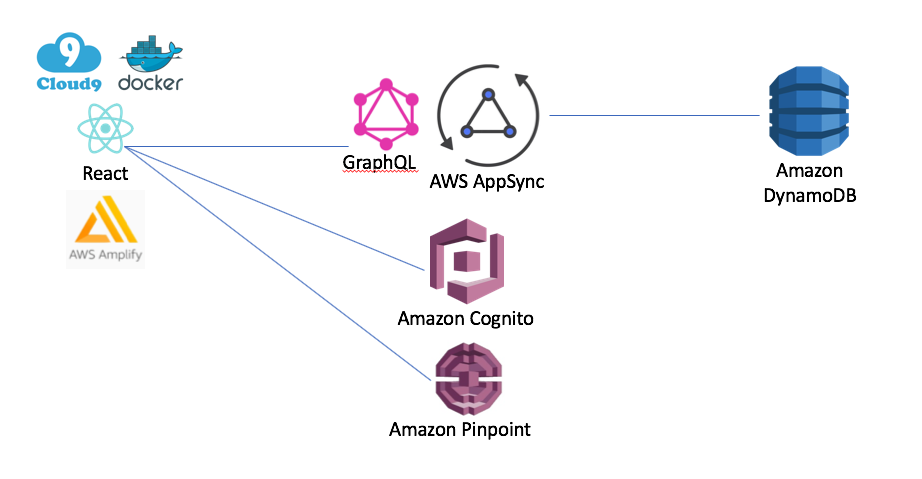
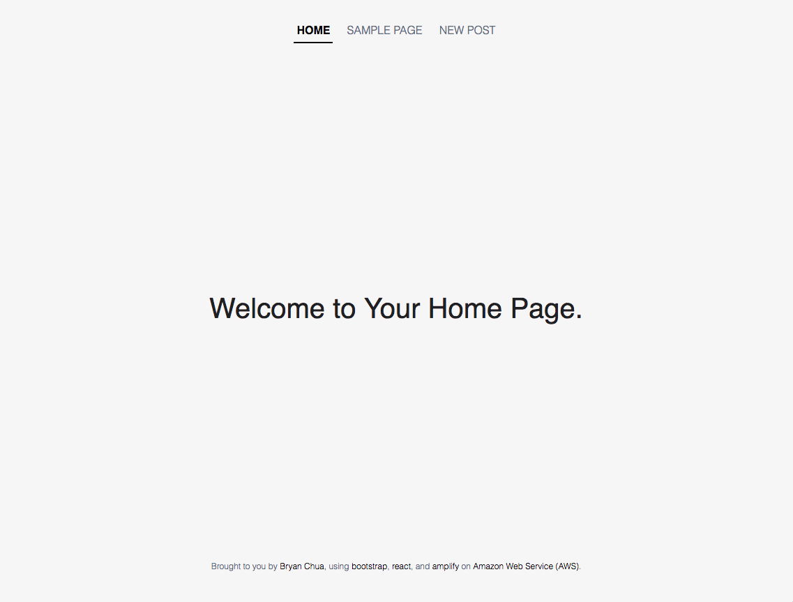
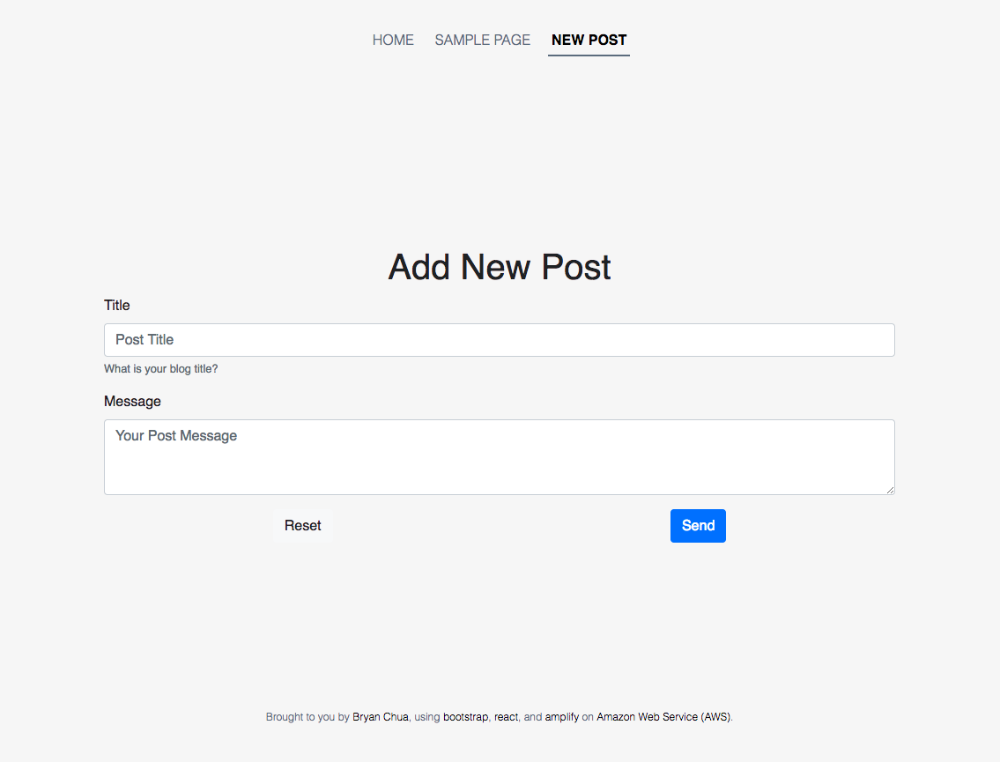

# A React Webapp with AWS Amplify

This is a self-paced workshop designed for developers who want to build a React Web application using [AWS Amplify](https://aws-amplify.github.io/) from [Amazon Web Services (AWS)](https://aws.amazon.com/).

## Reference Architecture



This is a sample web application to allow users to create blog posts on the website. My web application is written in [React](https://reactjs.org/) and I will also be using [AWS Amplify](https://aws-amplify.github.io/amplify-js/index.html) to quickly bootstrap the whole application. AWS Amplify provides a declarative and make it really easy to add features like authentication and analytic to our mobile application. Our backend will be powered by AWS AppSnyc, a fully managed GraphQL service. AWS AppSync defines a GraphQL Schema with data types and GraphQL operations (query, mutation and subscription). It also associate a set of resolvers to Amazon DynamoDB, where we have 1 dynamoDB table for our data model.

### Screenshots

<p float="left">
  
  
</p>


The data model will consist of:
* **Posts**: a list of posts (blog posts) that each consists of title and message

## [Lab 1](setup/)
Setup AWS Cloud9 and AWS environment.

## [Lab 2](amplifycli/)
Setup React development environment and AWS Amplify CLI in AWS Cloud9.

## [Lab 3](appsync/)
Setup AppSync & Pinpoint (Analytics)

## [Lab 4](app/)
Run your React App on your Browser!

## [Lab 5](cicd/) 
CI/CD for your React Web App

## Clean up

If you ever need to clean up your AWS account, you just need to run the following command in your AWS Cloud9 environment:

```
amplify delete
```
