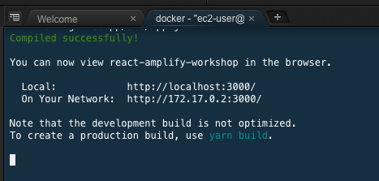
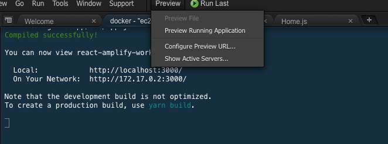
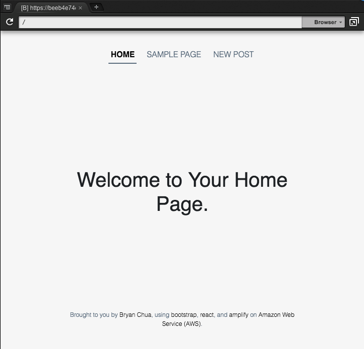

# React Native App with AWS Mobile Hub & AppSync

## Setup & Run The React Web App

**WARNING:** Make sure you are **inside React Docker** environment before you proceed.

We have prepared a sample app for you in this exercise. Please download it in your Cloud9 by entering the following commands:

```
cd /code
wget https://github.com/ykbryan/aws-react-amplify-workshop/raw/master/webapp.zip
unzip webapp.zip
mv webapp/* .
rm -Rf webapp/
rm webapp.zip
```

Run the following commands to get your web app running in your AWS Cloud9:
```
cd /code && yarn
yarn start
```

**Note**: if your `yarn` is **outdated**, please enter the following command to upgrade `yarn`:
```
curl -o- -L https://yarnpkg.com/install.sh | bash
```

**Note** if you see the following **no space left** error, please restart your Cloud9 instance.
```
Error: ENOSPC: no space left on device, write
error Could not write file "/code/yarn-error.log": "ENOSPC: no space left on device, write"
error An unexpected error occurred: "Command failed.
Exit code: 1
```

## Run your Web App in Cloud9

Once you have successfully ran `yarn start` without any errors, you should see "Compiled successfully!" in green and the following screen on the Docker terminal.



In order to preview the web app, you have to click "Preview" at the top panel & select "Preview Running Application".



And you should now see the web app running on a separate tab.



## Bonus Exercise
Notice that some part of the app might not be working. You are not complete the following in order to make this app work:
1. Complete the graphql query posts at `src/components/Home.js`
2. Complete the graphql mutation post at `src/components/New.js`
3. Complete the graphql query to get a particular post at `src/components/Sample.js`
