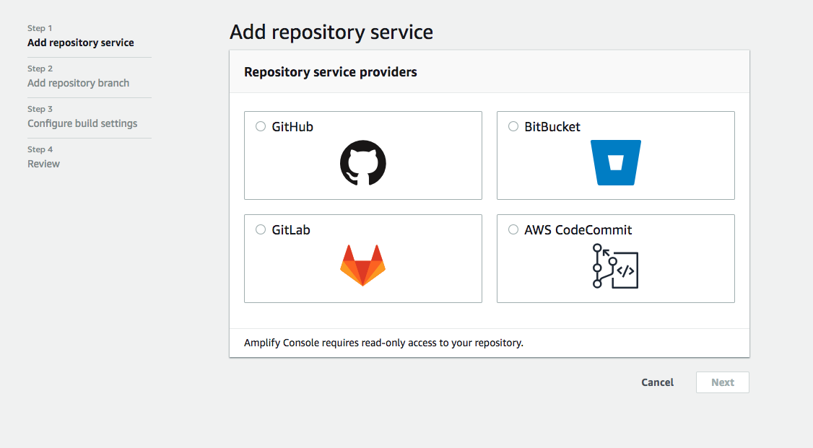
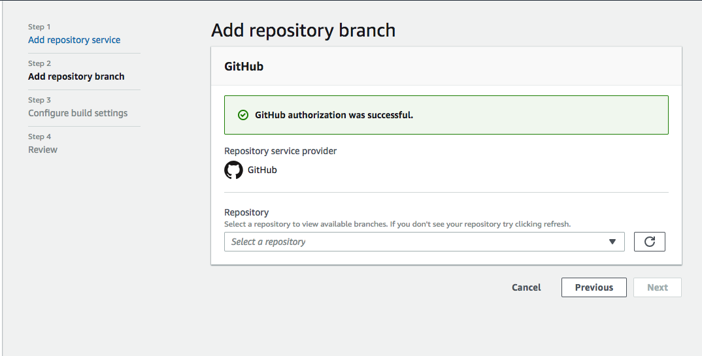
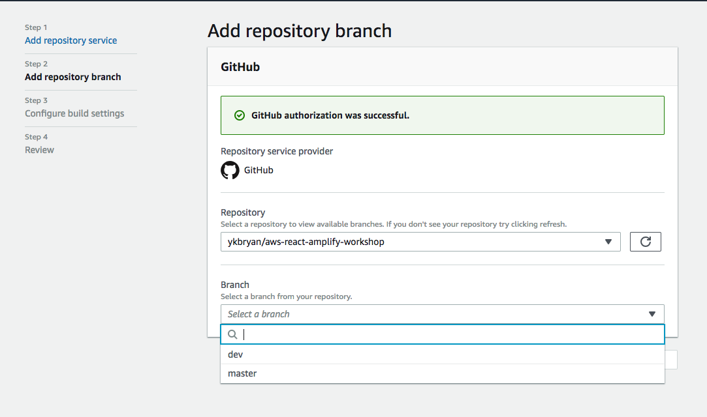
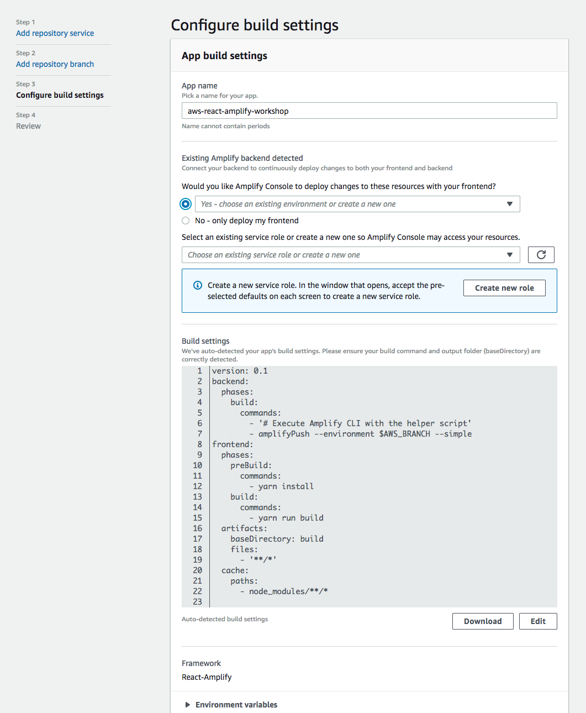
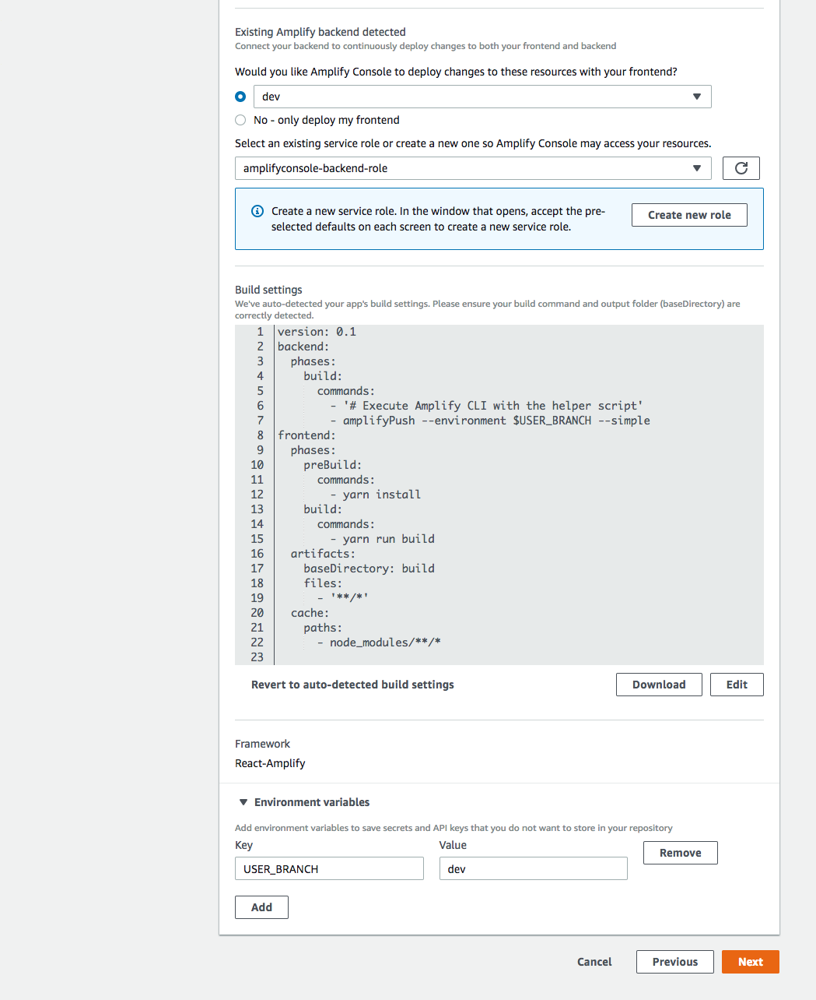
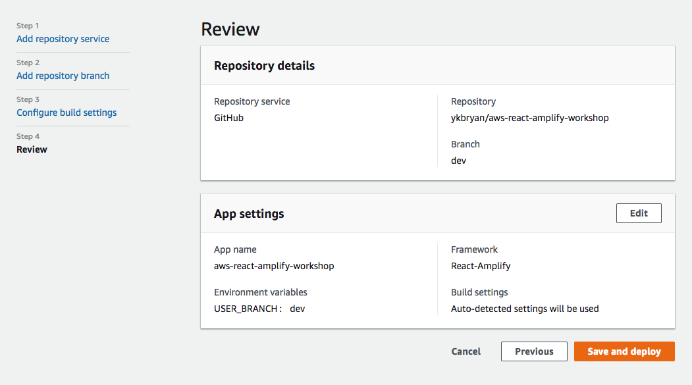
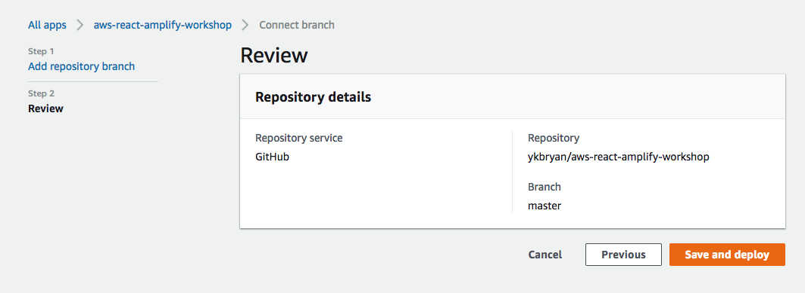

# CI/CD for Web App

Amplify Console provides you the way to Build, deploy, and host modern web apps. At the same time, you can manage multiple environments of your Amplify project (backend + frontend) as well as using a project within a team or outside a team using the Amplify CLI & Git. Check out this [link understand the multienv concept](https://aws-amplify.github.io/docs/cli/multienv#concepts).

(Note: at the time of this update, AWS Amplify Console is not yet available in all region. Please check your AWS console to verify.)

## Setup your first Pipeline

Start your Amplify Console as connecting to your app's repository.

Select one of the repository service providers and authorize the access to AWS Amplify Console to proceed.

Select the app and its branch to proceed.

Now, configure your build setting. First, select the environment tied to this deployment.

Now, create a new role/select an existing service role for your build process.
Review the build setting, including your environment variables, and update accordingly to your needs. 
Once done, press "Next" to proceed.

At the last step, you are to review the settings provided. Press "Save and deploy".

## Connect to the rest of the branch

At the Amplify Console, select "Connect Branch" at the top right of the page.

Select the branch you want to connect to. (Note: if this page took too long to load, hard refresh by pressing F5 or ctl-R / cmd-R on your keyboard).

Review your setting and proceed by pressing "Save and deploy"

* Note: Repeat to connect to more branches.

Now, your Amplify Console should look like this:

Now that you are set, you can push and deploy changes to your backend into different env based on git branches. This setup is more for a team sharing a project, working together. Find out more details [here](https://aws-amplify.github.io/docs/cli/multienv#team-workflow).