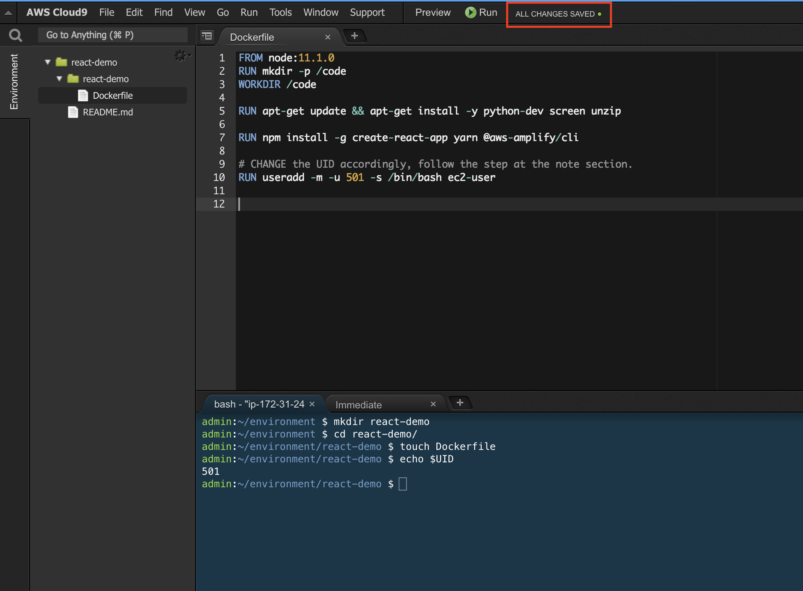
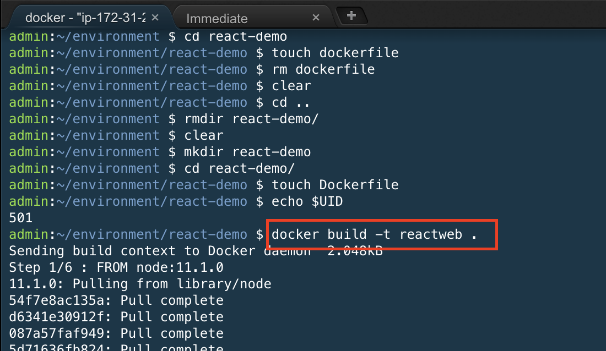
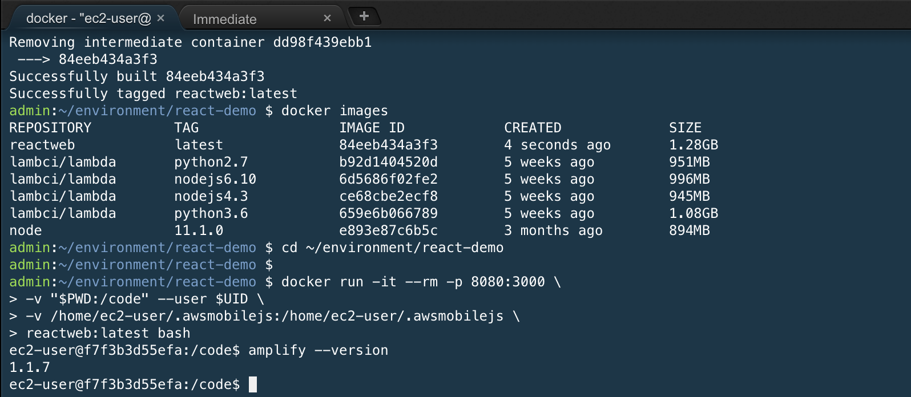

# Setup
We will be using React to develop our web app and will run a React Web App inside a docker container on [AWS Cloud9](https://aws.amazon.com/cloud9/). 

## Table of Contents

**Configure Cloud9**
* [Create Cloud9 environment](#create-cloud9-environment)
* [Allocate storage](#allocate-storage)

**Configure React Docker Environment**
* [Create React Docker Environment](#create-react-docker-environment)

# Configure Cloud9
## Create Cloud9 environment

1. Click the link [here](https://ap-southeast-1.console.aws.amazon.com/cloud9/home/product?region=ap-southeast-1) to go to Cloud9 console. Sign in with your credentials if necessary. You need to be in **Singapore** region for this lab. 

2. Click on **Create Environment**.


3. Give any appropriate name and description to your environment. Click on **Next**.

4. Choose **M4.large** instance type and click on **Next**.

5. Click on **Create Environment**.

6. While it is being built, you may move on to the next section.

7. After a few minutes, when your environment is up, you should see following screen.


## Allocate storage
Your Cloud9 instance is allocated 8 GB storage by default. We will increase this because we will be installing dependencies.

1. Go to your running instances by clicking [here](https://ap-southeast-1.console.aws.amazon.com/ec2/v2/home?region=ap-southeast-1#Instances:sort=desc:launchTime)

2. Find the instance you have just created by launching a Cloud9 environment. The name will be `aws-cloud9-<your environment name>-<random string>`


3. Select the instance. Scroll down at the bottom part. Find the Block devices.


4. Click onto it. You will see a pop up.


5. Right click on it and open in new tab.


6. Click on **Actions**, **Modify Volume**.


7. Change *8* to *120* and click on **Modify**.


8. Click on **Yes** and wait for the change to finish. It will take a couple of minutes.


9. Go back and select your instance. Reboot that instance to make sure the EBS changes take effect.

# Create React Docker Environment

AWS Cloud9 environment comes pre-installed with Docker.

1. Go back to your Cloud9 environment


2. Let's create a working directory. We have chosen the name as **rn**. Type `mkdir rn` to create the directory. Press **Enter** key.


3. Switch to the newly created directory. Type `cd rn`


4. Create a `Dockerfile` which is the definition of the docker container that will host our React development environment. Type `touch Dockerfile`. And press **Enter** key. You will find a Dockerfile created inside the `rn` folder.


5. Double click to open it.


6. Copy the following commands and paste inside the file. Take a few minutes to review this file. We are also installing the AWS mobile CLI.

```
FROM node:11.1.0
RUN mkdir -p /code
WORKDIR /code

RUN apt-get update && apt-get install -y python-dev screen

RUN npm install -g create-react-app yarn @aws-amplify/cli

# CHANGE the UID accordingly, follow the step at the note section.
RUN useradd -m -u 501 -s /bin/bash ec2-user
```

Note: find out what is your cloud UID by doing `echo $UID`. By default (at this time of the workshop), the UID is __501__.


7. Save it by pressing `Command + S` keys for Mac. Or `Control + S` keys for Windows. You can see **All Changes Saved** sign at the top of the Cloud9 Window.


8. Go back to the lower window. Key in `docker build -t reactweb .` and press **Enter** key. Notice this command ends with a dot.


9. This will take *a few minutes*. You might see some `npm warnings` in red around optional dependencies. You can ignore them.

10.	You can verify your image was successfully built by typing `docker images`. You should see a `reactweb` image.

11. Start the React Docker using this image with the command below.
This step allows us to use AWS Cloud9 to be the IDE for our React project under the directory ```~/environment/rn``` while having a Docker container execute the React web server. 
```
cd ~/environment/rn

docker run -it --rm -p 8080:3000 \
-v "$PWD:/code" --user $UID \
-v /home/ec2-user/.awsmobilejs:/home/ec2-user/.awsmobilejs \
 reactweb:latest bash

```

Now that you are in the container, run `amplify --version` to double check that the amplify CLI has been properly installed in the docker container.



Now you have successfully setup your AWS Cloud9 in your AWS account, you can now proceed to [next section](../).  